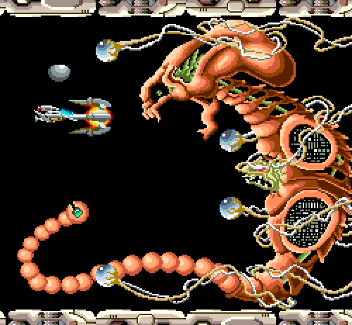
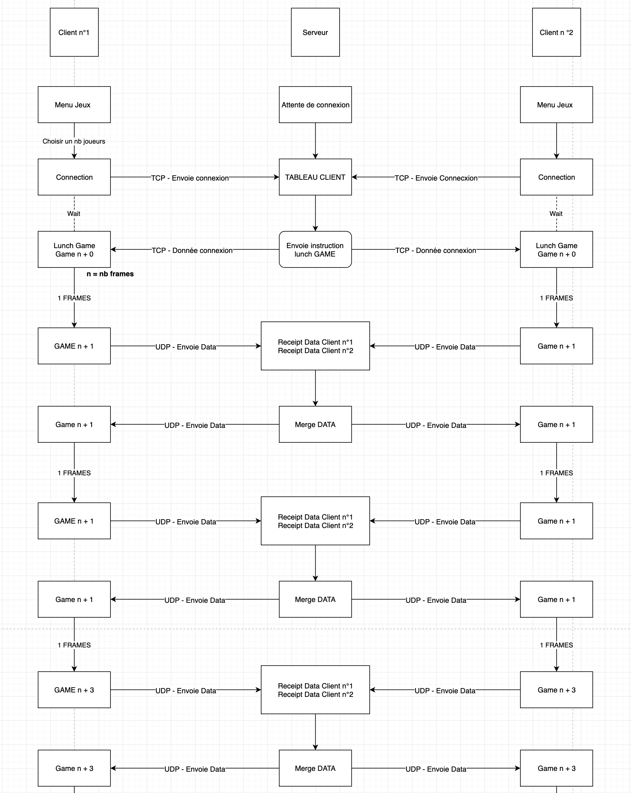
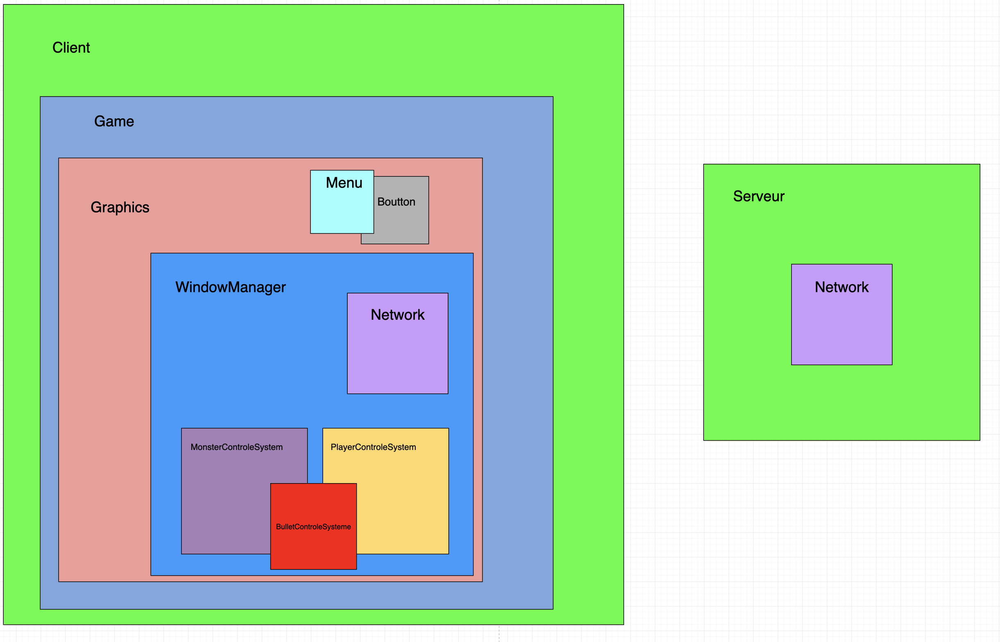

# R-Type project Epitech Promo 2025

This project aims to recreate the [R-Type](https://en.wikipedia.org/wiki/R-Type) game and add a multiplayer mode to it.



---
This project is compiles using Cmake : https://cmake.org/

The game is built using SFML : https://www.sfml-dev.org/

The network part of the project is built using the Asio library : https://think-async.com/Asio/

Documentation for the project is generated using Doxygen : https://doxygen.nl/index.html

---

Access to [Documentation](https://yemanjag.github.io/R-Type-2022/)

---
# Instructions to build 
---
Run at the root of the folder
---
To download the dependencies needed for the project. This will generate a Makefile.
```
Cmake ./
```
To run the previously generated Makefile
```
Make
```
The Makefille will generate two binaries, one for the server and one for the client
To run the server binary
```
./R-Type-server
```
To run the client binary
```
./R-Type-client
```
---

# Network protocol :
---
The client side Network loops in a thread in the NetworkLoop() function.

**How does it work ?**

The client sends the following instruction to the server :

```
Connexion::Ready::[nb_client_total] 
```
The server answers :

```
" Connexion::[nb_client_total]::[n_current_client] "
```
It can continue in the following loop :

- It parses the incoming data
- It assigns the new values to the client
- Send the client's current state to the server

CLASSIC SEND : <span class="bg-info text-success"> Commande</span>::Argument1::Argument2

Commande = [Action | Position | Connexion]

```
Connexion -> Connexion::[nb_client_total]::[n_current_client]
    // nb_client_total = total number of clients
    // n_current_client = number of the current client
```

```
Position -> Positon([n_joueur])::[pos_x];[pos_y]
    // n_joueur = number of the client to set 
    // pos_x = X position to set
    // pos_y = Y position to set
    
```

```
Action -> Action([n_joueur])::[type_Action]
    // n_joueur = number of the client to set 
    // type_action = Type of action to set(shoot / ulti / die)
```

Exemple : 

- Client(1) -> Serveur = Connexion::Ready::2
- Client(2) -> Serveur = Connexion::Ready::2
- Server -> Client(1) = Connexion::2::1
- Server -> Client(2) = Connexion::2::2
- Client() -> Server = Pos(1)::100.00;100.00|Act(2)::Nothing




---

# Architecture :

---



---

# Ajouter un monstre ? :

---

To add a monster, you need to create a new monster class like this :

```
class Mob
{
    public:
        Mob1(Position);
        ~Mob1();
        void UpdateMob1(); //Update the position of mob1
        void setPosition(); //Set the position of the shape
    private:
        sf::CircleShape _shapeMob1; // Shape of mob1
        Position _SpawnPos; //Starting position
        Position _posMob1; //Current position
        Direction _dir; // Current direction
        Speed _speed; // Movement speed
};
```

And to increment it in Handle Monster and WaveLaunch :

```
void Monster::HandleMonster()
{
    if (_actifWave == false) {
        if (_level == 1)
            WaveLunch(2, 1);
        if (_level == 2)
            WaveLunch(4, 2);
        if (_level == 3)
            WaveLunch(6, 3);
    }
}
```

---

# Change graphical library

---

Our R-Type project uses the SFML library.
It's possible to change the library in the lib_graphic.hpp and lib_graphic.cpp files.

You need to replace the following function content with the right call to your graphical library.

Example : 

Replace : 
```        
void LibGraphic::Draw()
{
_window->draw(texture);
}
```
By : 
```        
void LibGraphic::Draw()
{
DrawTexture(texture, screenWidth/2 - texture.width/2, screenHeight/2 - texture.height/2 - 40, WHITE);
}
```

---

# Change network library

---
Le projet R-Type utilise la librairie ASIO pour le réseaux. 

Il vous suffit de remplacer l'intérieur des fonctions par le bon appel à votre librairie.

Example : 

Replace : 
```        
void LibNetwork::send_udp()
{
    graphics->_windowManager._network->_socket->send_to(asio::buffer(Sender, std::strlen(Sender)), *graphics->_windowManager._network->>_endpoints.begin());   
}
```
By : 
```        
void LibNetwork::send_udp()
{
 "Your send fonction"
}
```

